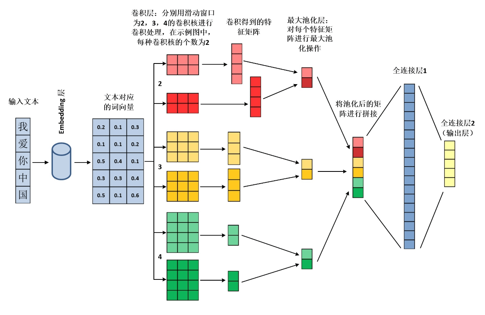
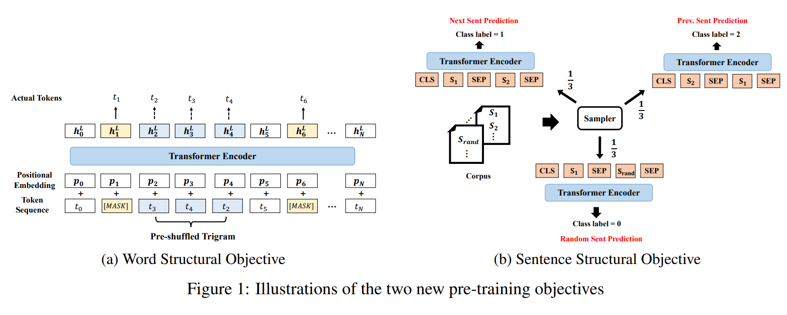

# 2023-SCNUAI-contest
第四届华南师大人工智能算法挑战赛 第八名解决方案
=====

## 比赛内容

题目：**法律类案检索**

比赛网址：

https://aistudio.baidu.com/aistudio/competition/detail/899/0/introduction 


类案检索作为人工智能支持司法审判的重要内容，对于提升法院整体裁判水平、实现类案适法统一、促进司法公正有极其重要的积极意义。


## 比赛任务

给定若干查询案例，每一个查询案例均对应一个大小为100的候选案例池给定一个查询文本，要求从候选案例池中筛选出与查询案例相关的类案，即对100个候选案件进行相似度排序，使得类似案件尽可能排在前面。

输入：查询文本、候选案件

输出：候选案例相似度由高到低的排名列表

## 数据集获取
类案检索任务数据集使用中国民事类案检索数据集，包含15181个查询案例和总数为1518100的候选案例池，所有案例文本均来自公开的中国民事案件判决书，涉及84种类别的民事案件。数据集由若干<查询文本，候选集，类案序号>组成。比赛数据集划分为训练集、测试集和验证集，训练集共8500条数据，测试集共2181条数据，验证集共4500条数据，其中验证集的数据不包含gt_idx字段

**注意：本仓库目录下 ./data/wenshu_ms_dataset/dev 文件夹下的数据用于展示，并不完整。完整数据获取请参见下方链接：**
https://aistudio.baidu.com/aistudio/datasetdetail/205651

**注意：基于Bert的TextCNN模型和StructBert模型的训练集由于文件太大，在本仓库中并未上传，有需要者可自行运行data_process文件夹中脚本文件获取，或从以下网盘链接的方式获取：**

**TextCNN 训练集数据**

链接：https://pan.baidu.com/s/1-tWrbI4kquUhWIKM70wmVQ?pwd=scnu 

提取码：scnu 

**StructBert 训练集数据**

链接：https://pan.baidu.com/s/1jyQH5HMf08e4R-aLzklbgg?pwd=scnu

提取码：scnu 


## 解决方案大致思路
1. 根据JudgeAccusation字段的法律文案作为训练样本，以category下的cat1和cat2字段作为训练标签，构建TextCNN文本多分类模型。同时，为了提高预测的准确率，我们做了以下改进：
* 在TextCNN模型中的嵌入层，由原来的随机Embedding构造词向量，改进为基于Transformer的Bert预训练模型下的词向量转换
* 最长文本长度设置为512，该长度适用于所给数据集下的大部分法律文案，并前后比较截取方式对准确率的影响，采取了以两头向中间截取的方式，剔除前后杂余的无效信息
* 在训练过程中采用Adam优化器，每训练一个batch都计算相应训练集和测试集的准确率，采取交叉熵损失函数，并实时对比训练过程loss的梯度下降过程，不断调整学习率等模型参数

**TextCNN 模型的示意图如下：**



2. 我们探索数据发现，每个query下的候选案例ctxs的前一部分的category属性相同，但它们中的一部分不在类似案件gt_idx的列表当中。因此，我们根据它们是否在gt_idx列表当中，构建基于阿里云改进的StructBert的文本相似二分类模型，用于在category相同的候选案例中筛选在当前query下的类似案例gt_idx。实践证明，这一步可让结果提升大约4个百分点。尽管有不小的提升，但存在着以下改进空间：
* 对于StructBert模型的训练集构建，我们只采用了一个字段来构建，即JudgeAccusation. 一方面，该字段的特征信息在TextCNN模型下已被大量学习了，因此在StructBert模型中选取除JudgeAccusation以外别的特征效果可能更明显；另一方面，可以采取多个字段相辅的方式来构造训练集，这也是一个很大的改进空间，也是本团队没有得到更好名次的原因之一。

**StructBert 模型的示意图如下：**



## 实现平台
1. 对于TextCNN模型，本团队在本地构建模型代码，并上传至**Kaggle平台**，进行GPU加速训练，一共训练了30个epoch，34类标签在测试集上的平均准确率为 0.86
2. 对于StructBert模型，本团队在阿里云的**ModelScope平台**实现，共训练了7个epoch，二分类标签在测试集上的准确率为 0.8386

## 参考文献
@article{wang2019structbert,
  title={Structbert: Incorporating language structures into pre-training for deep language understanding},
  author={Wang, Wei and Bi, Bin and Yan, Ming and Wu, Chen and Bao, Zuyi and Xia, Jiangnan and Peng, Liwei and Si, Luo},
  journal={arXiv preprint arXiv:1908.04577},
  year={2019}
}

## 文件目录

```
├─.ipynb_checkpoints
├─data
│  └─wenshu_ms_dataset
│      └─dev
├─data_process
│  └─.ipynb_checkpoints
├─result
├─StructBert-classifier
│  ├─.ipynb_checkpoints
│  └─workspace
│      ├─output
│      └─tmp
└─TextCNN-classifier
    ├─.ipynb_checkpoints
    └─models
```

